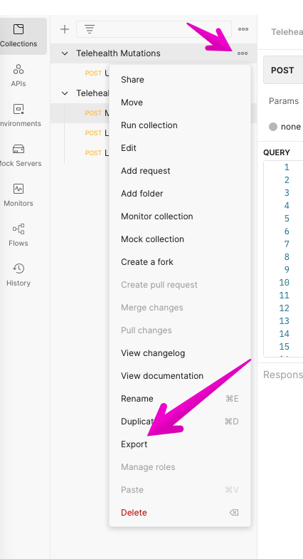
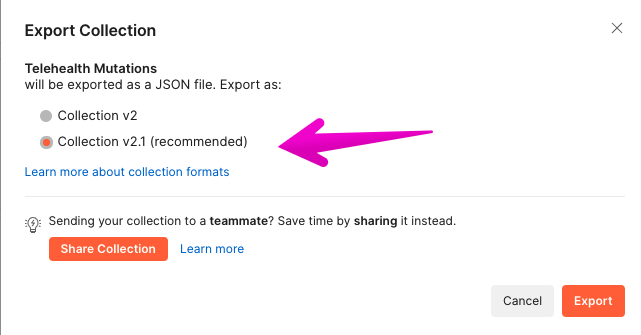

# Postman Setup

## tRPC setup

For postman to hit via REST route, we add these two lines to any procedure we'd wish to interact with.
Note the `path` below will equate to `localhost:3000/api/create-an-endpoint`.

`private` is added to keep this route from being documented in the `/api/openapi` docs route.

```js
    .meta({ openapi: { method: 'POST', path: '/create-an-endpoint', private: true } })
    .output(z.object({}) // required for OpenAPI
```

## Permissions

Currently, passing an auth header has not been created/tested.
However, this **should work the same way with tRPC checking the header and adding the currentUser to context.
For now when testing/building with postman, you can update the procedure to be `public` to bypass the auth check.

## Import/Export

A sample Postman collection has been exported to this folder.
This includes Global Variables, Environments, and Collections.

## Environments

- Global Environment: Contains the BASE_API_URL, BASE_TRPC_URL
  - **api:** `localhost:3000/api`
- As User Environment: Contains the token for Collection Calls. update the `token` with the JWT.
- As Admin Environment: Contains the token for Collection Calls. update the `token` with the Google SSO Access Token.

Note: You'll need to ensure the User, Vet exists in your DB if testing locally.

### Exporting for the Repo

To Export simply navigate to the collection or Environment and click the three little dots. then Export as the recommended. Overwrite the files in [docs/postman](./postman/) with your new files.

NOTE: If you **REALLY** like Postman, you can opt into a Team Share, where you no longer have to worry about exporting back/forth. Rather everyone can just mob in the "Koala" workspace. This is a paid thing tho, so we'd only recommend if you find it useful for the team at large. Otherwise Import and Playground away.

UPDATE: Apparently Postman can now import/export via GitHub integration **/shrug** We haven't tested this yet... but looks promising to avoid "Teams $$"



